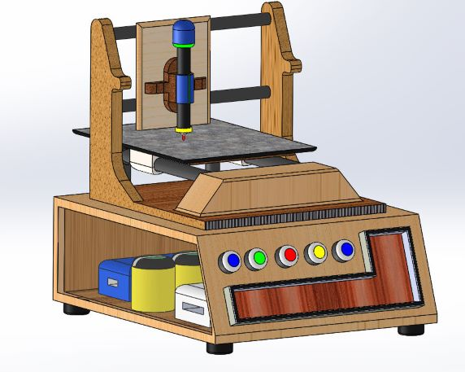

# Solid Works

  
  

  
  

<h2>This Repository contains Several 3D Model I designed using SolidWorks</h2>

* Cooling Fan
* Home Model
* Cycle - I Basically Designed different parts sapatetally like padel,seat,handel,tyres.etc and Assembled them together.
* CNC Machine - A College Project, I Completed in 3 different parts and finally Assembled them and then added animation to it.
