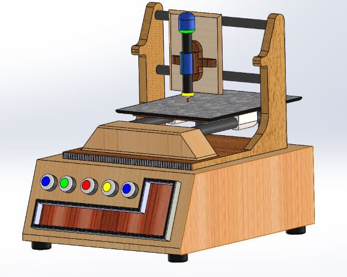
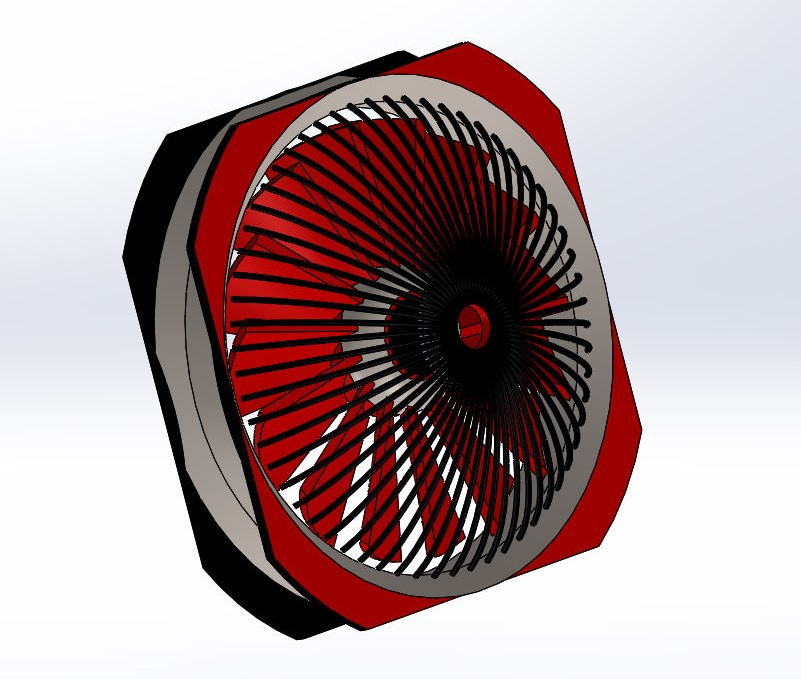
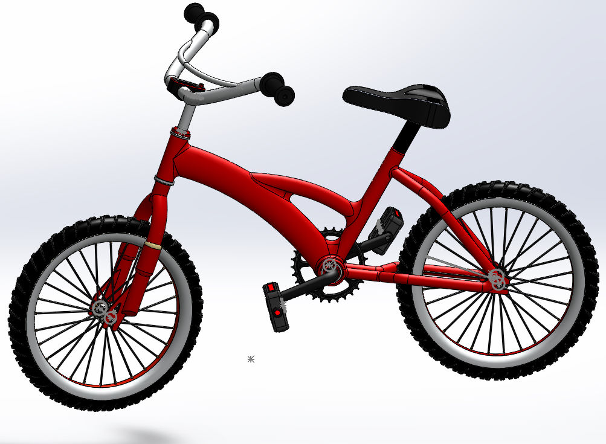

# Solid Works
<h2>This Repository contains Several 3D Model I designed using SolidWorks</h2>

* <b>Cooling Fan and Home Model </b> - Both models are designed  as a single body. 
* <b>Cycle </b> - I Basically designed different parts sapatetally such as padel, seat, handel, tyres.etc and assembled them together.
* <b>CNC Machine </b> - A college project, I completed in 3 different parts and finally Assembled them and then added animation to it.

  
  
 
  
  
  

  
  
  

   
  

